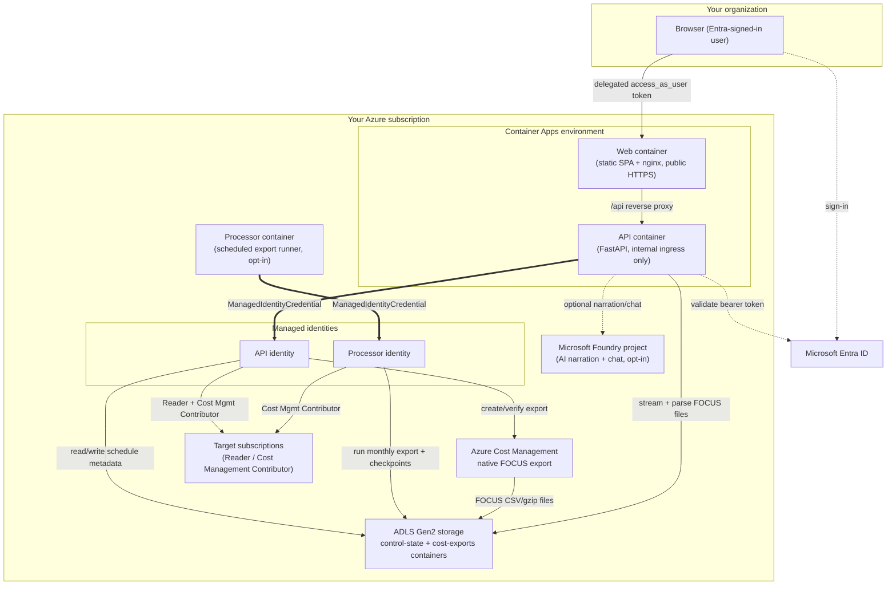

# MeghKoshaAI

**MeghKoshaAI** is a self-hosted Azure cost-assessment and FinOps dashboard. It turns native Azure Cost Management FOCUS exports into an executive-ready cost report, a rolling six-month cost history, resource-level optimization recommendations, and an optional AI narrative — all running on your own infrastructure, in your own Azure subscription, under your own identity.

You deploy it once into a subscription of your choice, grant it three read/cost-management role assignments on the subscriptions you want it to analyze, and it takes care of the rest: creating the native cost export, scheduling the rolling six-month pull, and rendering the dashboards below.

> This is a reference deployment intended for a single organization/tenant to run for itself. It is not a multi-tenant SaaS product — every deployment is isolated to the Azure subscription it's installed into.

## Contents

- [What it does](#what-it-does)
- [Architecture](#architecture)
- [System design](#system-design)
- [Dashboards and tabs](#dashboards-and-tabs)
- [Prerequisites](#prerequisites)
- [Deploying to Azure](#deploying-to-azure)
- [The three manual role assignments](#the-three-manual-role-assignments)
- [Local development](#local-development)
- [Security notes](#security-notes)

## What it does

- **Reads, never writes billing data.** All cost figures come from Azure's own native FOCUS 1.2-preview cost export — the same export format used by FinOps toolkit customers — so the numbers reconcile with your Azure invoice.
- **Sets itself up.** Once the required roles are visible to its managed identity, the app automatically creates the native export and a six-month rolling schedule; you do not hand-configure Cost Management exports yourself.
- **Assesses resources, not just spend.** It cross-references billed cost with resource inventory, Azure Advisor, Azure Monitor metrics, and SQL/compute/storage/network signals to flag idle and overprovisioned resources.
- **Explains itself.** An optional Microsoft Foundry-backed agent turns the reconciled findings into a written executive summary and answers follow-up questions in a chat panel — this stays off until you explicitly enable it.
- **Stays inside your tenant.** Authentication is delegated Microsoft Entra ID sign-in; the API validates a bearer token issued for itself. The browser never receives an Azure Resource Manager token, and the app never requests Entra admin consent.

## Architecture



**Deployable profiles.** The Bicep template is additive across three profiles, so you only provision what you plan to use:

| Profile | Adds | Use it when |
| --- | --- | --- |
| `core` | Network, Container Apps environment, registry, logging, API/web managed identities | You just want the foundation up, or you're not ready to run exports yet |
| `data` | HNS-enabled ADLS Gen2 storage, private Blob/DFS endpoints, container-scoped data roles, the processor identity | You want the app to create exports and run the six-month rolling schedule |
| `ai` | A private Foundry account/project and model deployments | You want the executive-summary narrative and the Chat tab |

Each profile is a superset of the previous one. Application containers only deploy once you supply built image references (see [Deploying to Azure](#deploying-to-azure)); the AI runtime and processor stay disabled until you explicitly enable them, even after the underlying infrastructure exists.

## System design

**Identity and authorization.** The single-page app requests only its own API's `access_as_user` delegated scope from Entra ID — never an Azure Resource Manager scope. The API independently validates that bearer token's issuer, audience, tenant, and client before trusting it. Azure-side calls (discovering subscriptions, reading resources, creating exports) are made with the API's own **user-assigned managed identity** via `ManagedIdentityCredential`, then filtered against the signed-in user's own Azure RBAC role on each subscription — so a user only ever sees subscriptions they themselves have access to, not everything the identity can reach.

**Export creation and scheduling.** Once a target subscription's Reader and Cost Management Contributor grants are visible to the API identity, opening **Schedules** automatically creates a native FOCUS export (CSV/gzip, partitioned, overwrite-enabled) pointing at the deployment's own ADLS account, and saves an active six-month schedule — no manual export configuration step is required. A separate **processor** identity (kept intentionally distinct from the API identity) runs the actual monthly export executions on a cron schedule, checkpointing progress per subscription so a restart or a missed tick doesn't re-run months that already succeeded.

**Report generation.** The API streams each month's compressed FOCUS CSV directly from ADLS, validates its schema and row shape against the delivery manifest, and reconciles it with a live resource inventory, Azure Advisor recommendations, and (where enabled) Azure Monitor metrics before rendering the dashboards below.

**Foundry AI (optional).** The `ai` profile provisions a private Foundry account/project. `APP_ENABLE_CHAT_RUNTIME=true` uses that app's own approved `model-router` deployment to narrate grounded Chat answers from deterministic API and FOCUS evidence; amounts and rankings remain application-computed. The separate `APP_ENABLE_AI_RUNTIME` switch controls only the hosted-agent Executive Summary narrator. Either path can fall back without blocking the dashboard.

**No silent write access.** The app's managed identities only ever hold Reader and Cost Management Contributor roles that you grant explicitly (see below). It has no ability to modify budgets, resources, or IAM outside of the one disclosed, narrowly-scoped side effect of creating its own cost export.

## Dashboards and tabs

The app has three top-level views — **Report**, **Chat**, and **Schedules** — reachable from the top navigation bar. **Report** is further organized into a left-hand sidebar of grouped pages:

| Group | Pages | What you'll find there |
| --- | --- | --- |
| **Dashboard** | Executive Summary | The narrated (or plain, if AI is disabled) top-line summary: total spend, trend, and the highest-priority findings across the whole assessment. |
| **Cost Management** | Subscription Breakdown, History, Cost by Hour, Cost by Tags, EA Pricing, Rate Optimization, Cost Anomalies, Budgets | Where the money actually went: cost split by subscription, historical trend, hourly granularity, tag-based cost attribution, EA/negotiated pricing context, Reservation/Savings Plan coverage, anomaly detection against expected spend, and budget tracking. |
| **Resources** | Stale Resources, Governance & Risk | Inventory-driven findings: unattached disks, stopped VMs, idle gateways, orphaned NICs, and similar candidates for cleanup, plus governance/policy and tagging risk signals. |
| **Analytics** | Advisor Reconciliation | Cross-checks the app's own findings against Azure Advisor's own recommendations, so you can see where the two agree (or don't) and why. |
| **Recommendations** | Savings Roadmap, Compute Optimization, Storage Optimization, Network Optimization, Azure SQL Optimization, AI Optimization | Domain-specific rightsizing and elimination recommendations, each backed by either verified billed cost, Advisor's own estimate, or Azure Monitor-verified idle metrics — the evidence type is always shown next to the number. |
| **Reports** | Action Plan | A consolidated, exportable list of every recommended action across all domains, prioritized and ready to hand to whoever owns remediation. |

Two other top-level views round out the app:

- **Chat** — ask follow-up questions about the current report in natural language (enabled by the `ai` profile and `APP_ENABLE_CHAT_RUNTIME=true`).
- **Schedules** — see per-subscription export/schedule status, trigger the automatic setup described above, and pause, resume, or manually run a subscription's monthly cycle.

## Prerequisites

The subscription you deploy MeghKoshaAI **into** must have the [`Microsoft.CostManagementExports` resource provider](https://learn.microsoft.com/azure/azure-resource-manager/management/resource-providers-and-types) registered. Azure Cost Management uses it to reach the export destination storage account that this deployment creates. Register it once, before your first deployment:

```powershell
az provider register --namespace Microsoft.CostManagementExports --subscription <subscription-id>
```

Registration usually completes in under a minute. Confirm it reports `Registered` before deploying:

```powershell
az provider show --namespace Microsoft.CostManagementExports --subscription <subscription-id> --query registrationState -o tsv
```

**Register the subscription that hosts the export destination storage account** — that is, the subscription you deploy this app into. The subscriptions you only *assess* do not need it, so a deployment can happily export cost data for an unregistered subscription as long as its own storage account lives in a registered one. Registering requires **Contributor** or **Owner** on that subscription.

> Creating an export in the Azure portal registers this provider for you automatically, but MeghKoshaAI creates its export through the [Cost Management REST API](https://learn.microsoft.com/rest/api/cost-management/exports/create-or-update), which does not. If the provider is missing, Azure rejects the export-creation call with `400 Bad Request`, the **Schedules** tab shows **Export status unavailable** with *"FOCUS export configuration could not be confirmed"*, and no export is ever created — regardless of how correct your role assignments and storage firewall settings are. Registering the provider and then using **Refresh schedules** resolves it; nothing needs redeploying.

## Deploying to Azure

There are two ways to deploy: the recommended Azure Developer CLI workflow, or a portal-button path (ARM/Bicep templates can only reference already-built container images — they cannot build code from a repository by themselves).

### Option A — Azure Developer CLI, no Docker required

Requires [git](https://git-scm.com/), the [Azure Developer CLI](https://learn.microsoft.com/azure/developer/azure-developer-cli/), and the [Azure CLI](https://learn.microsoft.com/cli/azure/) installed locally, plus the [provider registration above](#prerequisites). Clone the repo first — `azd` reads `azure.yaml`/`infra/`/`api/`/`web/` from your local copy, it doesn't deploy directly from GitHub:

```powershell
git clone https://github.com/Saby007/MeghKoshaAI.git
cd MeghKoshaAI
azd auth login
pwsh ./scripts/deploy-ai.ps1 -EnvironmentName my-environment -Location centralindia
```

The helper previews before deploying, configures the recommended `ai` profile, deploys the app-local Model Router, builds remotely in ACR, retries only the known Foundry-readiness and first-image-handoff conditions, enables the six-month processor after the API image exists, and verifies `/api/health`. Use `-SkipProcessor` only when schedules are intentionally out of scope.

The equivalent settings applied by the helper are:

```powershell
$modelRouter = '[{"name":"model-router","modelFormat":"OpenAI","modelName":"model-router","modelVersion":"2025-11-18","sku":"GlobalStandard","capacity":20}]'

azd env new my-environment
azd env set AZURE_LOCATION centralindia
azd env set APP_PROFILE ai
azd env set APP_EXPORT_TRUSTED_SERVICES true
azd env set APP_MODEL_DEPLOYMENTS $modelRouter
azd env set MODEL_ROUTER_DEPLOYMENT_NAME model-router
azd env set APP_ENABLE_CHAT_RUNTIME true
azd env set APP_AI_VALIDATED true
azd env set APP_ENABLE_AI_RUNTIME false
azd provision --preview
azd up
```

Set every value above before the first `azd up`. `APP_PROFILE=ai` includes the data/export infrastructure and adds the deployment's own private Foundry project and Model Router. `APP_ENABLE_AI_RUNTIME=false` keeps the separate hosted-agent Executive Summary narrator disabled; Chat still uses Model Router, while deterministic API/FOCUS code remains responsible for rankings, amounts, and other quantitative facts.

`azd up` provisions the infrastructure, including the app-specific `cost-agent-project` and `model-router` deployment for the `ai` profile, builds both container images **remotely in Azure Container Registry** (no local Docker or Podman needed — [azd's `remoteBuild` option](https://learn.microsoft.com/azure/developer/azure-developer-cli/azd-schema#docker) is enabled in this repo's [azure.yaml](azure.yaml)), pushes them, and deploys the running app.

> **A brand-new environment can require repeated `azd up` runs. Do not delete the environment between retries.** These are all transient — the helper detects and retries all four automatically; if you're running raw `azd up`, three of them just need a plain rerun, but the Foundry `Accepted` race needs one extra manual step from its **second** failure onward:
>
> | Error you see | Cause | What to do |
> | --- | --- | --- |
> | `resource not found: unable to find a resource with name 'ca-api-...'`/`'ca-web-...'` | The first pass provisions infrastructure and builds images in parallel; [main.bicep](infra/main.bicep) creates `ca-api-*`/`ca-web-*` only after those image names exist, and provisioning usually finishes before the remote image build does. | Just rerun `azd up`. The image names are now persisted in `azd env`, so this time Bicep creates the apps. |
> | `RequestConflict`/`AccountProvisioningStateInvalid` (`Accepted`) — **first occurrence** | The new AI Foundry account briefly stays `Accepted` while Azure finishes provisioning it. | Just rerun `azd up` once it reaches `Succeeded` (`az cognitiveservices account show -n <account> -g <resource-group> --query properties.provisioningState`). |
> | Same `RequestConflict`/`AccountProvisioningStateInvalid` — **still failing on the second+ retry** | Plain `azd up` re-declares (re-PUTs) the Cognitive Services account on **every** attempt, even with no changes — that PUT itself resets an already-`Succeeded` account back into a brief `Accepted` window right before the project/private-endpoint steps run, so a bare rerun can fail the same way indefinitely. | Run `azd env set APP_REUSE_AI_ACCOUNT true` once for this environment, then rerun `azd up`. This switches the project/model/private-endpoint resources to *reference* the existing account instead of re-declaring it, so it's never PUT again. |
> | `... cannot be saved, because this would overwrite an existing deployment which is still active` (`DeploymentActive`) | ARM keeps executing the previous `azd up`'s deployment graph even after its CLI process reported an error; retrying immediately can collide with that still-finishing deployment. | Wait roughly a minute for the prior deployment to finish, then rerun. |
> | `unable to pull image using Managed identity ... for registry ...` (usually on `Container App Job`) | The AcrPull role assignment for the processor's managed identity is granted in ARM immediately, but the registry's own data-plane authorization cache can lag behind by up to ~2 minutes. | Wait roughly 1–2 minutes for the role assignment to propagate, then rerun. |
>
> None of these require deleting the environment, the resource group, or setting `APP_RESTORE_AI_ACCOUNT=true` — that flag is unrelated (see the Troubleshooting section below) and setting it here makes things worse, not better.

If deploying with raw `azd up` instead of the helper, verify image handoff after a failed or partial first pass:

```powershell
azd env get-value SERVICE_API_IMAGE_NAME
azd env get-value SERVICE_WEB_IMAGE_NAME
azd up
```

If either image key is not set yet, rerun `azd up`; remote packaging will populate it.

If you intentionally want exports without Foundry chat, set `APP_PROFILE=data` and omit the five Model Router/chat settings. That is an opt-out path, not the recommended MeghKoshaAI/CloudLens deployment.

For both `data` and `ai`, keep `APP_EXPORT_TRUSTED_SERVICES=true` — [modules/data.bicep](infra/modules/data.bicep) otherwise leaves the storage account's `networkAcls.bypass` at `'None'`, which blocks Cost Management's export-creation call (it always shows **Export status unavailable**, regardless of subscription type or RBAC grants, until this is set).

> This grants Azure's own "trusted Microsoft services" exception (`Microsoft.CostManagementExports`) on the storage account's firewall — it's scoped to first-party Azure services, not a public network opening, and is required for native FOCUS exports to reach a firewalled/private-endpoint-only storage account at all. If your environment already exists without this set, apply it directly: `az storage account update -n <storage-account> -g <resource-group> --bypass AzureServices --default-action Deny`, then reload the Schedules tab.

> The export storage account is plain Blob storage (`isHnsEnabled: false`), not ADLS Gen2 — this matches every prior environment (Dev, Phase1) that has reliably created FOCUS exports. An earlier revision of this repo briefly enabled the hierarchical namespace and fully disabled `publicNetworkAccess`; that combination is untested with Cost Management's export-creation call and is not required by Microsoft's own documented firewall setup (`networkAcls.defaultAction: Deny` + `bypass: AzureServices` is sufficient). Note that in tenants with central governance policies (for example `StorageAccount_PublicNetwork_Modify`), `publicNetworkAccess` may still end up `Disabled` regardless of `APP_EXPORT_TRUSTED_SERVICES` — that's expected and fine; the `AzureServices` bypass is what actually matters, not the `publicNetworkAccess` value itself.

The helper enables the scheduled six-month FOCUS worker automatically once `SERVICE_API_IMAGE_NAME` exists. When using raw `azd up`, point the processor at the **same image `azd` built for the API service** after the first image publication:

```powershell
azd env set APP_ENABLE_PROCESSOR true
azd env set SERVICE_PROCESSOR_IMAGE_NAME (azd env get-value SERVICE_API_IMAGE_NAME)
azd up
```

Re-running `azd up` (or `azd deploy` alone) later picks up any code changes and updates the deployment in place.

> If `azd up`/`azd provision` crashes with a Go panic mentioning `HooksMiddleware`, that's a known `azd` bug ([azure-dev#10037](https://github.com/Azure/azure-dev/issues/10037)) unrelated to this repo — try upgrading `azd` (`azd version` to check, then reinstall the latest). If it persists, use Option B below instead.

### Troubleshooting: `azd up` fails on the AI Foundry account

These two errors are opposites of each other — only act on whichever one you actually see, and only for the environment name that's currently failing:

- **`FlagMustBeSetForRestore`** (`Microsoft.CognitiveServices/accounts` soft-deleted): a prior `azd down` on this *same* environment name left the AI Foundry account soft-deleted instead of purged. Fix it and retry:
  ```powershell
  azd env set APP_RESTORE_AI_ACCOUNT true
  azd up
  ```
- **`CanNotRestoreANonExistingResource`**: `APP_RESTORE_AI_ACCOUNT` is set to `true` on an environment that has nothing to restore — almost always because it was left set from a previous environment, or copied from another `.env`. Fix it and retry:
  ```powershell
  azd env set APP_RESTORE_AI_ACCOUNT false
  azd up
  ```

`APP_RESTORE_AI_ACCOUNT` defaults to `false` and is **not** part of the normal setup sequence above — it only matters when one of these two specific errors shows up, and it's scoped per environment (`azd env new` does not carry it over), so re-check it explicitly rather than assuming its value from a prior environment.

### Option B — Azure portal button (no CLI tooling required)


> **The Deploy to Azure button below only provisions infrastructure** — a resource group, network, Container Apps environment, container registry, and managed identities. It does **not** build or run the application by itself. You click the button **twice** in total (steps 1 and 3 — step 2 is just two terminal commands, no portal interaction): the second click reuses the **same environment name**, so it updates your existing deployment instead of creating a new one.

#### 1. Deploy the foundation

[](https://portal.azure.com/#create/Microsoft.Template/uri/https%3A%2F%2Fraw.githubusercontent.com%2FSaby007%2FMeghKoshaAI%2Fmain%2Finfra%2Fmain.json)

Clicking the button opens the Azure portal's subscription-scope custom deployment experience against this repo's [ARM template](infra/main.json) (compiled from [main.bicep](infra/main.bicep)). Pick the target subscription, choose an **environment name** (write it down — you'll reuse it in step 3) and a **profile** (`core`, `data`, or `ai`), leave `apiImage`/`webImage` blank, and provision. If you picked `data` or `ai`, also set **`allowNativeExportTrustedServices`** to `true` — otherwise the storage account's firewall never grants Cost Management's export-creation call an exception, and the Schedules tab will permanently show **Export status unavailable** no matter what subscription or RBAC grants you have.

When it finishes, open the deployment's **Outputs** tab and note:

- `AZURE_RESOURCE_GROUP`
- `AZURE_CONTAINER_REGISTRY_NAME`
- `AZURE_CONTAINER_REGISTRY_ENDPOINT`

#### 2. Push the code as container images

Step 1 created an Azure Container Registry (ACR) but left it empty — this step builds [api/Dockerfile](api/Dockerfile) and [web/Dockerfile](web/Dockerfile) from this repo and pushes them into it.

**No local Docker needed — build directly in ACR:**

```powershell
az acr build --registry <AZURE_CONTAINER_REGISTRY_NAME> --image cost-app/api:latest --file api/Dockerfile ./api
az acr build --registry <AZURE_CONTAINER_REGISTRY_NAME> --image cost-app/web:latest --file web/Dockerfile ./web
```

**Or, with local Docker installed:**

```powershell
az acr login --name <AZURE_CONTAINER_REGISTRY_NAME>
docker build -t <AZURE_CONTAINER_REGISTRY_ENDPOINT>/cost-app/api:latest -f api/Dockerfile ./api
docker build -t <AZURE_CONTAINER_REGISTRY_ENDPOINT>/cost-app/web:latest -f web/Dockerfile ./web
docker push <AZURE_CONTAINER_REGISTRY_ENDPOINT>/cost-app/api:latest
docker push <AZURE_CONTAINER_REGISTRY_ENDPOINT>/cost-app/web:latest
```

#### 3. Point the deployment at your images

Re-run the **same** deployment — same `environmentName` (and `resourceGroupName`, if you set one) as step 1 — this time supplying the images you just pushed, so it updates the existing resources in place rather than creating new ones.

**Portal:** Use the Deploy to Azure button again with identical `environmentName`/`profile`, and fill in:

- `apiImage`: `<AZURE_CONTAINER_REGISTRY_ENDPOINT>/cost-app/api:latest`
- `webImage`: `<AZURE_CONTAINER_REGISTRY_ENDPOINT>/cost-app/web:latest`

**CLI:**

```powershell
az deployment sub create --location <location> --template-file infra/main.json `
  --parameters environmentName=<same-environment-name> profile=<same-profile> `
  apiImage=<AZURE_CONTAINER_REGISTRY_ENDPOINT>/cost-app/api:latest `
  webImage=<AZURE_CONTAINER_REGISTRY_ENDPOINT>/cost-app/web:latest
```

Both containers only start once **both** image parameters are non-empty. Wait for the two Container Apps (`ca-api-*`, `ca-web-*`) to report **Running** before continuing.

### Then, either way

#### 4. Configure sign-in

This step creates two Microsoft Entra ID app registrations: a **public-client SPA** (what users sign into in the browser) and a **confidential-client API** (what validates their token). `scripts/bootstrap-identity.ps1` creates both for you — redirect URI, API scope, and the federated credential the API's managed identity needs — instead of you clicking through the Entra portal by hand.

> Run this with **PowerShell 7+** (`pwsh`), not Windows PowerShell 5.1 — the `-Apply` path uses `ConvertFrom-Json -AsHashtable`, which doesn't exist in 5.1. If you're on Windows and typed `./scripts/bootstrap-identity.ps1` directly, check `$PSVersionTable.PSVersion` first; if it's below 7, launch `pwsh` and run the command again from there.

**Gather the values the script needs.** If you deployed with `azd`, load them straight into PowerShell variables with `azd env get-value` (the singular form — it prints one raw, unquoted value per call, so it's safe to assign directly; the plural `azd env get-values` only *prints* everything to the terminal, it does **not** create variables for you):

```powershell
$AZURE_TENANT_ID = azd env get-value AZURE_TENANT_ID
$AZURE_SUBSCRIPTION_ID = azd env get-value AZURE_SUBSCRIPTION_ID
$AZURE_ENV_NAME = azd env get-value AZURE_ENV_NAME
$APP_WEB_ORIGIN = azd env get-value APP_WEB_ORIGIN
$MEGHKOSHA_OBO_MANAGED_IDENTITY_RESOURCE_ID = azd env get-value MEGHKOSHA_OBO_MANAGED_IDENTITY_RESOURCE_ID
```

If you deployed via the portal button instead, get the equivalent values from the deployment's **Outputs** tab and the resource group's `id-obo-*` managed identity resource ID, and set the four PowerShell variables above manually.

**Preview first — this is always safe and creates nothing:**

```powershell
./scripts/bootstrap-identity.ps1 `
  -TenantId $AZURE_TENANT_ID `
  -SubscriptionId $AZURE_SUBSCRIPTION_ID `
  -EnvironmentName $AZURE_ENV_NAME `
  -WebOrigin $APP_WEB_ORIGIN `
  -OboManagedIdentityResourceId $MEGHKOSHA_OBO_MANAGED_IDENTITY_RESOURCE_ID
```

This prints a JSON plan (the redirect URI, API scope, etc.) without creating anything. Review it, then apply it — this needs permission to create app registrations in your tenant (e.g. **Application Administrator**). The script requires its own explicit safety switch in addition to `-Apply`, so nothing is ever created by accident:

```powershell
$env:APP_ALLOW_AZURE_CHANGES = 'true'
./scripts/bootstrap-identity.ps1 -TenantId $AZURE_TENANT_ID -SubscriptionId $AZURE_SUBSCRIPTION_ID -EnvironmentName $AZURE_ENV_NAME -WebOrigin $APP_WEB_ORIGIN -OboManagedIdentityResourceId $MEGHKOSHA_OBO_MANAGED_IDENTITY_RESOURCE_ID -Apply
```

If Azure CLI reports `AADSTS530004` for an external/guest administrator, the resource tenant is requiring a compliant device without accepting the user's home-tenant compliance claim. A resource-tenant Entra administrator must enable the appropriate inbound cross-tenant **Trust compliant devices** setting (External Identities > Cross-tenant access settings) or adjust the applicable Conditional Access policy. Alternatively, run the bootstrap as an authorized member of the resource tenant from a compliant device. After the policy/account issue is resolved, refresh the Graph login and rerun:

```powershell
az logout
az login --tenant $AZURE_TENANT_ID --scope 'https://graph.microsoft.com/.default'
```

The output includes the two client IDs it just created. Feed them back into the deployment and redeploy:

```powershell
azd env set MEGHKOSHA_API_CLIENT_ID <api-app-client-id>
azd env set MEGHKOSHA_WEB_CLIENT_ID <web-app-client-id>
azd up
```

(Using the portal button instead? Redeploy with `apiClientId`/`webClientId` filled in with those same two values.) Reload the app afterward — it should show a real Microsoft sign-in screen instead of an identity-configuration error.

#### 5. Grant access to the subscriptions you want to assess

See [the three manual role assignments](#the-three-manual-role-assignments) below — this is the only manual, per-subscription step in the whole flow.

#### 6. Open the app

Sign in, open **Schedules**, and use **Refresh schedules**. Once the roles above are visible, the app finishes export and schedule setup on its own. After the first six-month cycle completes, open **Report** and select **Run report**.

If **Schedules** keeps reporting **Export status unavailable** or *"FOCUS export configuration could not be confirmed"* even though all three role assignments are in place, re-check the [`Microsoft.CostManagementExports` registration](#prerequisites) on the subscription you deployed into — that is the most common cause, and it is not something role assignments or a redeploy can fix.

## The three manual role assignments

Subscription access is deliberately kept **outside** the application — there is no in-app subscription-onboarding flow, and the app can never grant itself access. For every subscription you want it to assess, a user with **Owner** (or **User Access Administrator**) on that subscription must add three role assignments:

| Managed identity | Role to assign | Why |
| --- | --- | --- |
| API identity | **Reader** | Lets the app discover the subscription and read its resources, tags, policy, and Advisor data for the dashboards. |
| API identity | **Cost Management Contributor** | Lets the app create the native FOCUS export and save the schedule — a write action that Cost Management **Reader** cannot perform. |
| Processor identity | **Cost Management Contributor** | Lets the separate scheduled worker actually execute each monthly export run. Without this, the schedule can look "active" while the six-month cycle silently fails to advance. |

**Portal:** find both identities in **Azure portal → your resource group → id-api-\* / id-processor-\*** (their names start with those prefixes), then **Subscriptions → target subscription → Access control (IAM) → Add role assignment** for each role/identity pair above.

**CLI:** the identity names/principal IDs aren't in `azd`'s top-level outputs (only the OBO identity's are) — list them from the resource group instead:

```powershell
$RG = azd env get-value AZURE_RESOURCE_GROUP
az identity list -g $RG --query "[].{name:name, principalId:principalId}" -o table

$apiPrincipalId = az identity list -g $RG --query "[?starts_with(name,'id-api-')].principalId | [0]" -o tsv
$processorPrincipalId = az identity list -g $RG --query "[?starts_with(name,'id-processor-')].principalId | [0]" -o tsv
$targetSubscriptionId = "<subscription-id-you-want-to-assess>"

az role assignment create --assignee-object-id $apiPrincipalId --assignee-principal-type ServicePrincipal --role "Reader" --scope "/subscriptions/$targetSubscriptionId"
az role assignment create --assignee-object-id $apiPrincipalId --assignee-principal-type ServicePrincipal --role "Cost Management Contributor" --scope "/subscriptions/$targetSubscriptionId"
az role assignment create --assignee-object-id $processorPrincipalId --assignee-principal-type ServicePrincipal --role "Cost Management Contributor" --scope "/subscriptions/$targetSubscriptionId"
```

Allow a few minutes for RBAC propagation, then use **Refresh schedules** in the app.

> Use **Cost Management Contributor**, not **Cost Management Reader**, on both identities — creating and running a native export are both write actions (`.../exports/write` and `.../exports/run/action`), which Reader's `*/read` permissions do not cover.

## Local development

Requires Python 3.12+, Node 24+, and PowerShell 7.4+.

```powershell
# Backend
cd api
python -m venv .venv
./.venv/Scripts/Activate.ps1
pip install -r requirements-dev.txt
python -m uvicorn main:app --host 127.0.0.1 --port 8002

# Frontend (separate terminal)
cd web
npm ci
npm run dev
```

Copy [api/.env.example](api/.env.example) to `api/.env` and [web/.env.example](web/.env.example) to `web/.env.local`, and fill in your own Entra tenant/client IDs. Without a real Entra configuration, the app will fail closed on identity — this is expected; it does not fall back to an unauthenticated mode.

Run the test suites with:

```powershell
./scripts/test-baseline.ps1 -Suite All
```

Individual suites are `Backend`, `Frontend`, `Build`, and `Browser`. The runner uses synthetic settings and restricts backend sockets to loopback — no live Azure credentials are required to run the tests.

## Security notes

- The app never requests Entra admin consent, never requests an Azure Resource Manager scope from the browser, and never persists user bearer tokens.
- Its managed identities hold only the roles you explicitly grant (see above) plus whatever the deployment itself provisions (scoped ADLS container roles for reading/writing its own control-state and export data).
- Container images run as a non-root user on a minimal, digest-pinned base with no shell or package manager in the production image.
- All API responses that could contain cost or identity data are marked private/no-store.
- This is a reference implementation, not an audited commercial product — review the Bicep templates and RBAC grants before deploying into a production tenant.
